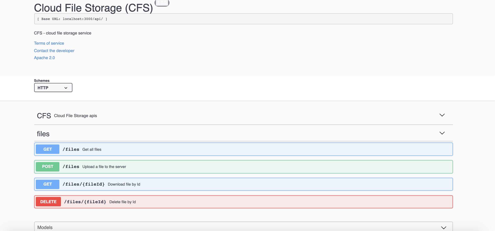
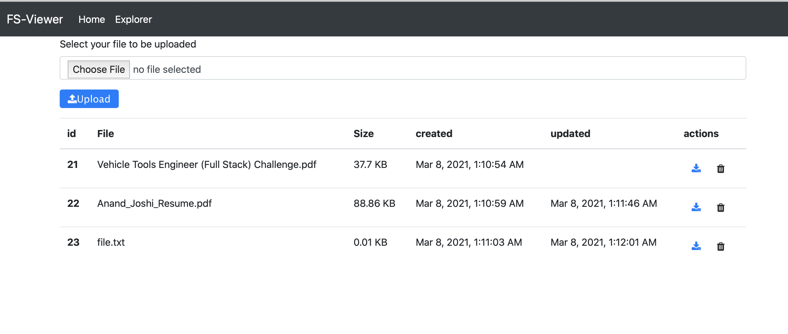
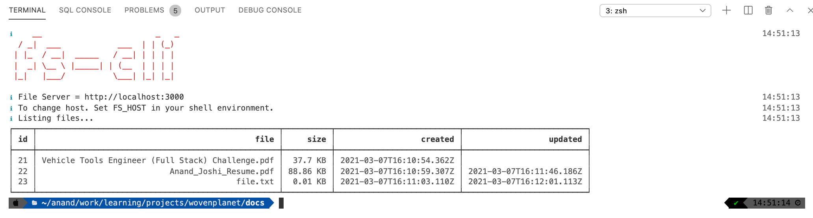

# Cloud File Storage - CFS

**Best Viewed on a markdown editor**

This project contains 3 apps. Server and web modules are `dockerized` and can be easily run using docker-compose.

## 1. Server

This is a nodejs/typescript app. For api documentation check swagger ui.



## 2. Web

This is an angular (v11) app. I used angular as I hadn't worked on front end for a long time and this was one framework, I had used
few years back.



## 3. Cli

This is a nodejs app that can be installed on local machine as a binary. Ideally we would distribute this over some cloud repository (like npm). For building this and installing locally, it requires node14+. (Might work on lower versions but not tested)



## Running the app

To start the server and web ui, execute the below commands.

```shell
## From root folder
docker build -t fs-server:latest ./server

## This might take 3-4 mins
docker build -t fs-ui:latest ./web/fs-ui

## Start api & web services
docker-compose up
```

Check web ui on [http://localhost:8080](http://localhost:8080)  
API documentation on [http://localhost:3000/api/docs](http://localhost:3000/api/docs)

## Installing cli locally

Ensure you're using node14+.
Execute the following command

```shell
cd cli/fs-store && yarn refresh && yarn local && cd ../..
```

Cli Usage -

```shell
Usage: fs-store [options]

Options:
  -V, --version          output the version number
  -u, --upload <file>    Upload file to the server
  -l, --list             List files on the server
  -d, --delete <fileId>  Delete file from the server
  -h, --help             display help for command
```

## TODO

1. Add test cases
2. Handle bad inputs on UI